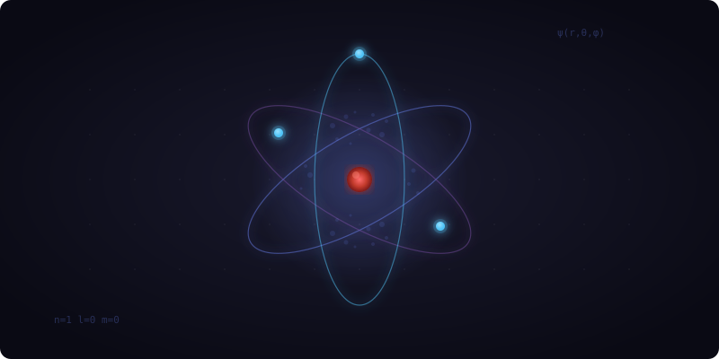

# Atomic Orbital Visualizer

<p align="center">
  
</p>

An interactive 3D visualization of atomic orbitals rendered in the browser using WebGPU.

Example deployed here: https://matthi1993.github.io/atomic-orbital-vis/

Vibe coded. Don't judge me on the code. 

## Getting Started

```bash
npm install
npm run dev
```

Then open the URL shown in the terminal.
